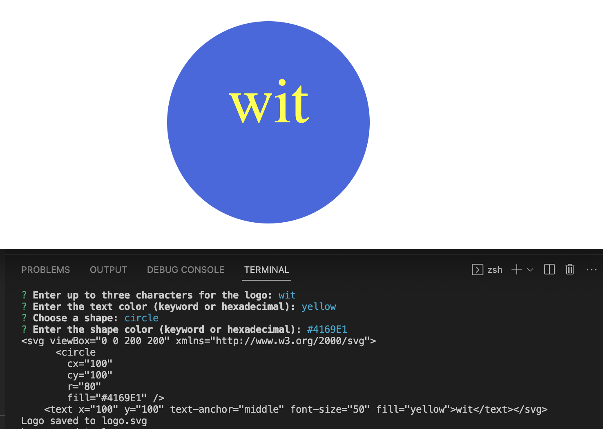
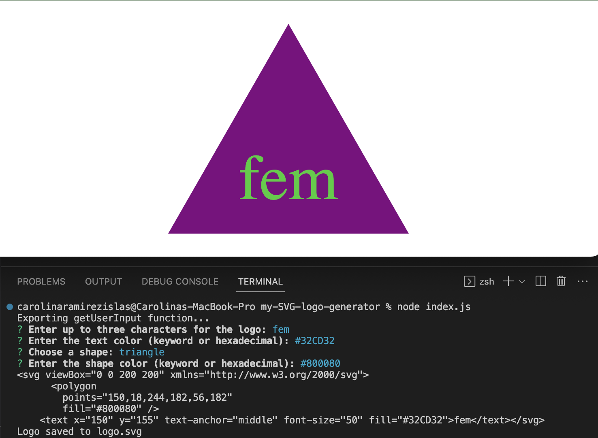
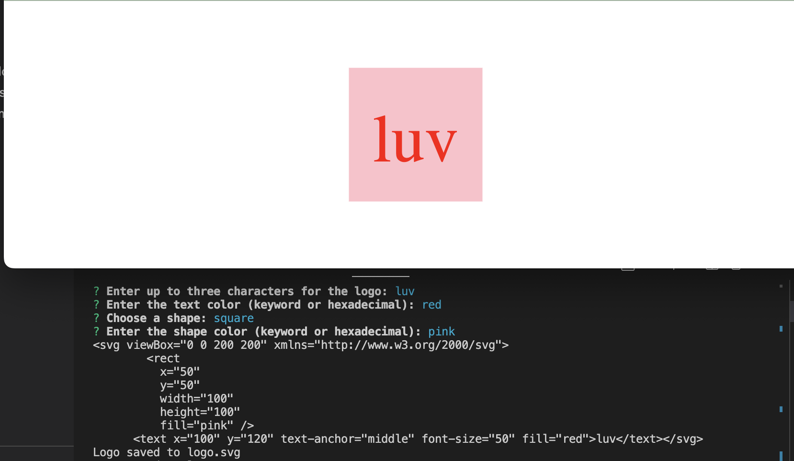

# my-SVG-logo-generator

## [Description:](#description)

The SVG Logo Generator is a command-line application that allows users to generate custom logos using Scalable Vector Graphics (SVG). The application provides a user-friendly interface where users can specify the shape, color, and text for their logo. With just a few clicks, users can create professional-looking logos for various purposes.

The application utilizes the following technologies and frameworks so that the application can deliver a seamless logo generation experience:

    JavaScript: The application is built using JavaScript, the programming language of the web, which enables dynamic and interactive features.

    Node.js: Node.js is used as the runtime environment for the application, allowing server-side execution of JavaScript code.

    Express.js: Express.js is a popular web framework for Node.js that simplifies the development of web applications. It is used to handle routing and serve the application's endpoints.

    Inquirer: Inquirer is a command-line interface (CLI) library for Node.js that provides an interactive interface for collecting user input. It is used in the application to prompt users for logo details.

    SVG-Captcha: The SVG-Captcha library is utilized to generate SVG images containing the specified text for the logo. It provides options for customizing the appearance of the generated images, such as size, noise, color, and background.

    File System (fs): The fs module is a built-in module in Node.js that allows interaction with the file system. It is used to write the generated SVG logo to a file on the server.

    Jest: Jest is a popular testing framework for JavaScript applications. It is used in the project to write and execute test cases for the various components and functionalities of the application.

## [Table of Contents:](#table-of-contents:)
   
- [Description](#description)
- [Installation](#installation)
- [Usage](#usage)
- [License](#license)
- [Contributing](#contributing)
- [Tests](#tests)
- [Questions](#questions)
   
## [Installation:](#installation:)

Before you continue, ensure you have met the following requirements:

* You have installed Node.js which includes npm (Node Package Manager). If they're not, you can download and install Node.js (which includes npm) from the official website: https://nodejs.org/.

Once those are installed:

1. Clone the repository or download the code to your local machine.
2. Open your terminal and navigate to the directory that contains the package.json file of the project.
3. Install the necessary dependencies by running the following command:
        
        npm install
    
        This command should be run in the directory that contains the package.json file, and it will install all the dependencies listed in that file.
    
After running the npm install command, you should have all the necessary dependencies installed and ready to use for running the SVG Logo Generator project.
    
## [Usage:](#usage:)

To generate and save an SVG logo using the SVG Logo Generator, follow these steps:

1. Make sure you have installed all the necessary dependencies as described in the Installation section.
2. Open your terminal and navigate to the project directory.
3. Run the following command to generate and save the logo:

        node index.js

        This command will execute the index.js file, which is responsible for generating and saving the logo.

4. Follow the prompts in the command-line interface to provide input for the logo generation. You will be asked to choose the shape type, shape color, text content, text color, and any custom color options.
5. After providing all the necessary input, the logo will be generated and saved as logo.svg in the project directory.
6. You can now find the generated logo file (logo.svg) in the project directory. Feel free to open it in a web browser or use it in your desired applications.

*[Video Walk-through: Testing App](https://drive.google.com/file/d/1IXSDfYVQcPBaMs4MhgXKBOn7WaBaXWvd/view)
If you are having issues viewing the walk-through video, download it then view it.*

Example of generated circle SVG using the SVG Logo Generator:

Example of generated triangle SVG using the SVG Logo Generator:

Example of generated square SVG using the SVG Logo Generator:

    To access the Github Repository visit:
    https://github.com/CarolinaRaIs/my-SVG-logo-generator

    To access the deployed site visit:
    https://carolinarais.github.io/prog-web-app-text-editor/   

## [License:](#license:)

       This project is licensed under the MIT license.
   
## [Contributing:](#contributing:)

       Contributions are welcome and encouraged for this project. If you find any issues or have any suggestions for new features, please open an issue or submit a pull request. Before submitting a pull request, please ensure that your code adheres to the project's coding guidelines and has appropriate test coverage. Thank you for your interest in contributing to this project!  
   
## [Tests:](#tests:)

       I encourage contributors to thoroughly explore the code and test it to ensure its functionality. Any feedback or suggestions regarding the testing process are welcomed and appreciated.
   
## [Questions:](#questions:)

       If you have any questions about the repo you can open an issue.

**If more questions arise you can also contact CarolinaRaIs at determination28@gmail.com**
   
       
------------------------------------------------------------------------------------------------
   
This README was generated by [CarolinaRaIs](https://github.com/CarolinaRaIs)